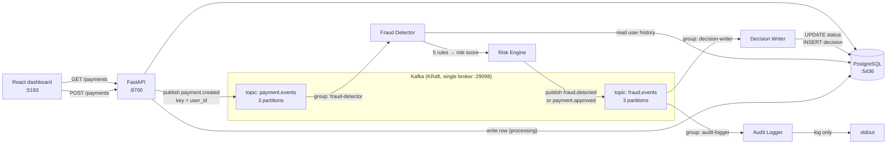
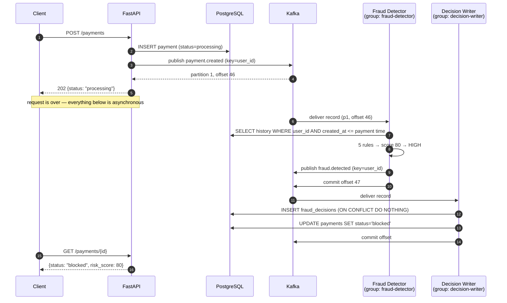
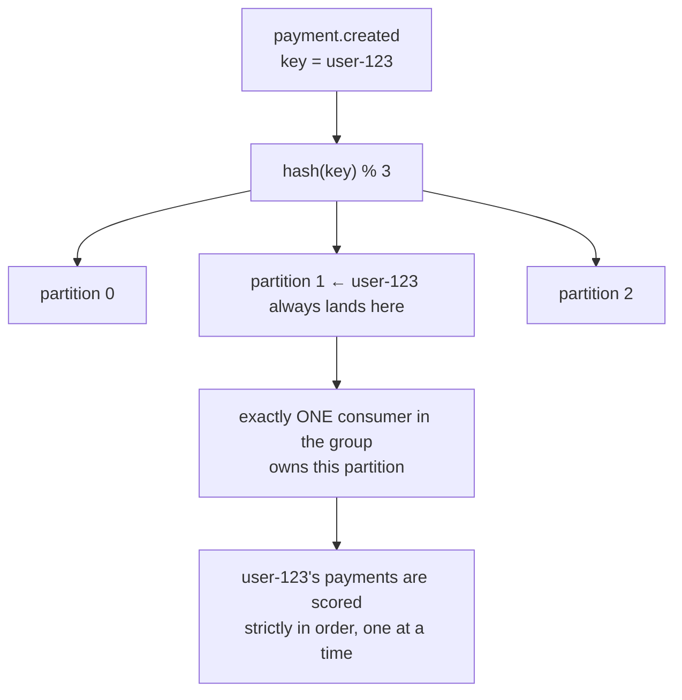

# Real-Time Fraud Detection — FastAPI + Kafka

A small payment system where fraud scoring happens **outside the request path**.
`POST /payments` writes a row, publishes one event, and returns `processing` in ~70 ms.
A separate Python service consumes that event, scores it against five rules, and publishes a
decision. A third service writes the outcome back to Postgres.

The domain is deliberately thin. The point is the **flow**: producer → broker → topic →
partition → offset → consumer group → commit → lag → replay.

---

## The one idea

```text
Without Kafka                          With Kafka
-------------                          ----------
Client                                 Client
  ↓                                      ↓
FastAPI                                FastAPI  ──→ Kafka ──→ (returns 202 now)
  ↓  fraud check (slow)                            ↓
Database                                        Fraud Detector
  ↓                                                ↓
Response (slow)                                 Risk Engine
                                                   ↓
                                                Database
```

The API's latency stops depending on how slow fraud analysis is. In exchange, the client learns
the outcome *later* — which is why `POST` returns `processing` and the status is polled.
That trade-off is the whole lesson; everything else is detail.

---

## Architecture



Two topics. **Three consumer groups.** `decision-writer` and `audit-logger` read the *same*
topic in *different* groups, so both receive every record with independent offsets. That is
fan-out, and it is what separates a log from a work queue.

### One payment, end to end



### Why every event is keyed by `user_id`



Every fraud rule asks *"what has this user done recently?"*. Key by `payment_id` instead and two
payments from one user land on different partitions, get scored **concurrently** by different
consumers, both read the same history, and both miss the pattern.

Ordering is guaranteed **per partition, never per topic** — so the key you choose *is* your
ordering guarantee. The cost: a busy user concentrates load on one partition. Check
`/kafka/inspect` and you will see an uneven spread. That is the trade-off, working as intended.

---

## Quick start

```bash
make up
```

Then, in order of usefulness:

```bash
make demo
```

```bash
make frontend
```

| What | URL |
|---|---|
| Dashboard | http://localhost:5193 |
| API docs | http://localhost:8700/docs |
| Kafka X-ray | http://localhost:8700/kafka/inspect |
| Kafka UI (`make ui`) | http://localhost:8092 |

### Ports

Chosen to coexist with other local stacks — none are Kafka/Postgres defaults.

| Service | Host port |
|---|---|
| FastAPI | 8700 |
| PostgreSQL | 5436 |
| Kafka (external listener) | 29098 |
| Kafka UI | 8092 |
| Vite dashboard | 5193 |

---

## Documentation

| Document | What it covers |
|---|---|
| [How Fraud Detection Works](docs/how-fraud-detection-works.md) | One payment followed through every stage — API → Postgres → Kafka → detector → risk engine → Kafka → Postgres → client, with the real log trace |
| [The Fraud Rules](docs/fraud-rules.md) | All five rules: config, SQL, worked examples that fire and that don't, how to trigger each one, limitations |
| [Point-in-Time Evaluation](docs/why-at-vs-now.md) | Why rules anchor to the payment's timestamp instead of `now()` |

## Kafka concepts, and where each one lives in the code

| Concept | Where to look | What to notice |
|---|---|---|
| **Producer** | [producer.py](backend/app/kafka/producer.py) | `acks=all`, idempotent, one long-lived instance |
| **Topic / partition** | [topics.py](backend/app/kafka/topics.py) | created explicitly with 3 partitions; broker auto-create is **off** |
| **Partition key** | [producer.py](backend/app/kafka/producer.py) `publish()` | `key=user_id` decides ordering *and* parallelism |
| **Offset** | every consumer log line | `topic / partition / offset` printed per record |
| **Consumer group** | [consumer.py](backend/app/kafka/consumer.py) | `group_id`, and why a 4th consumer sits idle |
| **Commit** | [consumer.py](backend/app/kafka/consumer.py) | `enable_auto_commit=False`, commit *after* the work |
| **At-least-once** | [fraud_decisions.py](backend/app/repositories/fraud_decisions.py) | `ON CONFLICT DO NOTHING` makes replays harmless |
| **Fan-out** | [audit_logger.py](backend/app/consumers/audit_logger.py) | second group on the same topic |
| **Lag** | [inspect.py](backend/app/kafka/inspect.py) | `end_offset − committed_offset` |
| **Rebalance** | `make scale` | 3 partitions redistribute across 3 members |

---

## Experiments worth running

These are the point of the project. Each one takes under a minute.

**1. Watch a rebalance.**

```bash
make scale
```

Then `make inspect` — one member owning `[0,1,2]` becomes three members owning one partition each.
Push it to `--scale fraud-detector=4` and the fourth member owns **nothing**: partition count is a
hard cap on group parallelism.

**2. Replay history from offset 0.**

```bash
./scripts/replay.sh
```

Rewinds `audit-logger` to the earliest offset. It reprocesses every fraud event ever published —
because consuming never deleted them. `decision-writer` is untouched: separate group, separate
offsets.

**3. Prove the handler is idempotent.**

```bash
./scripts/replay.sh decision-writer fraud.events
```

Same replay, but on the consumer that *writes*. Every decision is re-delivered and re-applied, and
the database ends up identical — the `first_time=False` log lines are the unique constraint
absorbing the duplicates.

**4. Create lag on purpose.**

```bash
docker compose stop fraud-detector && make burst
```

`make inspect` now shows lag climbing on `payment.events`, and every payment stuck at `processing`.
Start the detector again and watch it drain to zero.

**5. Break the flow deliberately.**

Stop `decision-writer` and submit a payment. The detector still scores it and `fraud.events` still
receives the record — the pipeline does not care that nobody is listening yet. The status just
stays `processing` until the writer comes back and catches up from its committed offset.

---

## The fraud rules

| # | Rule | Fires when | Score |
|---|---|---|---|
| 1 | Transaction frequency | ≥ 20 payments by the user in 30s | +40 |
| 2 | Large amount | amount > $5,000 | +20 |
| 3 | Repeated blocks | ≥ 5 blocked payments in 5 min | +20 |
| 4 | Country change | country differs from previous payment, within 1h | +30 |
| 5 | New device | device never used by this user before | +10 |

Score → level: `0–29 LOW`, `30–69 MEDIUM`, `70–100 HIGH`, `101+ CRITICAL`.
**≥ 70 blocks** the payment and publishes `fraud.detected`; anything lower publishes
`payment.approved`. All thresholds live in [config.py](backend/app/core/config.py).

`make burst` simulates an account takeover: 19 ordinary payments, then the frequency threshold is
crossed while the country and device change on every payment — 40 + 30 + 10 = **80, HIGH,
blocked**. Once five are blocked, rule 3 pushes the next to 100.

> Rule 3 replaces the PRD's "failed payments" rule. Nothing in this system ever produces a
> `failed` status, so that rule could never have fired. `blocked` is the equivalent signal, and it
> makes past decisions feed back into future scoring.

---

## Layout

```text
backend/app/
├── api/            HTTP only — parse, call, serialise
├── consumers/      three Kafka consumer processes, one file each
├── core/           config, logging, db session
├── fraud/          rules.py (the five rules) → risk_engine.py (pure scoring) → detector.py
├── kafka/          producer.py, consumer.py, topics.py, inspect.py
├── models/         SQLAlchemy
├── repositories/   every SQL statement
└── schemas/        Pydantic — payment.py (HTTP) and events.py (the Kafka contract)
frontend/           Vite + React dashboard
scripts/            demo.sh, burst.sh, replay.sh
```

One installable package shared by the API and the consumers, so the event schemas and the models
have exactly one definition. Each consumer is still its own OS process with its own group — which
is what the PRD's separate `fraud_detector/` directory was really describing.

## Running it locally without Docker

```bash
cd backend && uv venv && uv pip install -e ".[dev]"
```

```bash
uv run uvicorn app.main:app --reload --port 8700
```

```bash
uv run python -m app.consumers.fraud_detector
```

Point `KAFKA_BOOTSTRAP_SERVERS` at `localhost:29098` and `DATABASE_URL` at `localhost:5436` — see
`.env.example`. Kafka and Postgres still come from `docker compose up -d kafka postgres`.

## Tests

```bash
cd backend && .venv/bin/python -m pytest tests -q
```

`tests/unit/` is pure scoring — no I/O, runs anywhere. `tests/integration/` runs the rules against
the real Postgres from compose (`make up` first), because the rules *are* time-window SQL and the
bugs they had were bugs in the SQL semantics. Several tests are explicit regressions — see the
gotchas below.

---

## Conventions & gotchas

Things learned the hard way here. Do not regress them.

- **Anchor history queries to the payment's `created_at`, never to `now()`.** The detector runs
  behind the producer, so during a burst the payments *after* the one being scored are already in
  the table. "The user's most recent payment" returned a payment from the future, and the country
  and device rules silently never fired. Anchoring also makes rules 1, 2, 4 and 5
  **replay-deterministic**, which matters because at-least-once delivery guarantees replays.
- **Rule 3 is the one rule that is not replay-deterministic** — it reads `status`, which is written
  asynchronously. Accepted: it is a slow-moving signal.
- **`/payments/stuck` must be declared before `/payments/{payment_id}`.** FastAPI matches routes in
  order, so a literal path registered after a parameterised one is unreachable.
- **`consumer.partitions_for_topic()` returns `None` for topics the consumer is not subscribed to**,
  even after `await consumer.topics()` — that call returns a fresh metadata object and does not
  update the client's cache. `inspect.py` uses `admin.describe_topics()` instead.
- **Known dual-write gap.** The API writes the row and *then* publishes. Those two steps are not
  atomic: kill the process in between and the payment is stranded at `processing` with no event.
  The real fix is a transactional outbox, which is out of scope — so the gap is made observable via
  `GET /payments/stuck` instead of hidden.
- **A consumer group's offsets can only be reset while the group has no active members** — that is
  why `replay.sh` stops the container first.
- **Broker auto-topic-creation is off.** If a topic were created implicitly by the first producer
  it would get the broker default of one partition, and nothing about groups or rebalancing would
  be observable.
- **Host Python is 3.9**, so the helper scripts avoid f-strings with quotes inside; formatting lives
  in `scripts/_show.py`.
- Kafka and Kafka UI heaps are capped (`-Xmx512m` / `-Xmx256m`) with `mem_limit` set, because this
  Docker VM runs several stacks at once.

## Not built, on purpose

No ML, no Schema Registry, no Kafka Streams/Flink, no Redis, no Kubernetes, no auth. Also no retry
topic or DLQ yet: a failing handler logs with its `topic/partition/offset`, refuses to commit, and
the record is redelivered. Adding `fraud.retry` → `fraud.dlq` with an attempt counter in the record
headers is the natural next step once the happy path is boring.
